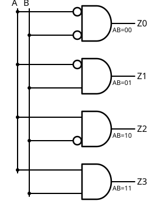

# 04 Decodificador

[⬅ Volver al índice](README.md)

Ya vimos las [cinco compuertas lógicas](02%20Compuertas.md) y cómo usar
una de sus patitas como
[línea de control](03%20ConfiguracionesSencillas.md). Ahora vamos a dar un
paso más: con la compuerta AND podemos **detectar** algo.

## Norma de escritura de circuitos

A partir de acá los circuitos tienen cables que se cruzan, y necesitamos
una norma para saber si hay contacto entre ellos: si el cruce tiene un
**circulito**, hay contacto (como una soldadura); sin circulito, no hay
contacto, uno pasa por arriba del otro.

> Otra norma habitual en bibliografía hace lo inverso: una jorobita marca
> "sin contacto" y un cruce simple se sobreentiende con contacto. Acá
> usamos circulito = contacto.

## Bus de líneas y combinaciones

Imaginemos un bus de ocho líneas — de direcciones, de datos, no importa —
por donde van pasando distintas configuraciones de 8 bits. Con ocho
líneas hay 2⁸ = **256** combinaciones posibles.

## Detectar una combinación con una compuerta AND

Conectemos las ocho líneas del bus a una AND de ocho entradas, con salida
Z. ¿Cuándo se pone Z en uno? Solo cuando **todas** las entradas son uno,
es decir, con la combinación 11111111 (FF en hexadecimal, 255 en
decimal). Es la única combinación de las 256 que activa la salida.

Ahora, si en vez de conectar las ocho líneas directamente les ponemos un
inversor a **algunas** de ellas, cambia qué combinación detecta la AND:
cada entrada con inversor necesita un cero en esa línea para producir un
uno hacia la compuerta, y cada entrada sin inversor necesita
directamente un uno. Por ejemplo, poniendo inversor en siete de las ocho
entradas y dejando la restante directa, la AND se pone en uno únicamente
con la combinación "siete ceros y un uno" en esa posición.

En definitiva: una compuerta AND solo tiene **una** combinación de
entrada que la activa. Combinándola con inversores en las entradas que
correspondan, se puede armar un circuito que detecte **cualquier**
combinación particular que nos interese.

## El decodificador de 2 entradas

Apliquemos esto para armar cuatro AND de dos entradas (A y B), una por
cada combinación posible, con salidas Z0, Z1, Z2 y Z3:

| A | B | Z0 | Z1 | Z2 | Z3 |
|---|---|----|----|----|----|
| 0 | 0 | 1  | 0  | 0  | 0  |
| 0 | 1 | 0  | 1  | 0  | 0  |
| 1 | 0 | 0  | 0  | 1  | 0  |
| 1 | 1 | 0  | 0  | 0  | 1  |

Para cada combinación de A y B, se activa una única salida (la que
detecta esa combinación puntual) y las demás quedan en cero. Notemos
además que el número de la salida que se activa coincide con el valor
decimal de AB: 00 → Z0, 01 → Z1, 10 → Z2, 11 → Z3.

## Definición general

Un **decodificador** es un circuito con **N entradas** y **2ᴺ salidas**,
donde ante cada combinación de entrada se activa una única salida y todas
las demás quedan en cero:

| N (entradas) | 2ᴺ (salidas) |
|---|---|
| 2 | 4 |
| 3 | 8 |
| 4 | 16 |
| 5 | 32 |
| 6 | 64 |

## Aplicación: memoria

En Sistemas de Computación I vimos que el bus de direcciones activa un
decodificador, y cada combinación de dirección activa una posición de
memoria distinta. En las memorias reales, el bus de direcciones suele
dividirse en dos: un **decodificador de fila** y un **decodificador de
columna**. Ante una dirección dada, se selecciona una única fila y una
única columna, y en su cruce está la posición de memoria direccionada.

---
[⬅ Volver al índice](README.md)
