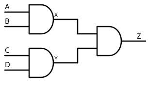
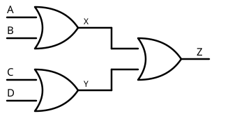

# 05 Otras Configuraciones

[⬅ Volver al índice](README.md)

Ahora vamos a ver otras combinaciones de compuertas un poco más
complejas, siempre a partir de las mismas [compuertas base](02%20Compuertas.md).

## Armar una AND de cuatro entradas con AND de dos entradas



Si solo se consiguen AND de dos entradas, se puede armar una de cuatro:
dos AND de dos entradas (A·B y C·D) alimentando una tercera AND.

```
X = A · B
Y = C · D
Z = X · Y  →  Z = A · B · C · D
```

## Armar una OR de cuatro entradas con OR de dos entradas



Mismo esquema con OR:

```
X = A + B
Y = C + D
Z = X + Y  →  Z = A + B + C + D
```

Esto funciona porque el álgebra de Boole cumple las propiedades
distributiva y conmutativa, igual que el álgebra numérica.

## Reducir la cantidad de entradas de una compuerta

Para convertir una AND de cuatro entradas en una de tres, se conecta la
entrada sobrante a un **uno permanente** (tensión máxima):

```
Z = A · B · C · 1  →  Z = A · B · C
```

Para una OR, se conecta la entrada sobrante a **cero permanente**:

```
Z = A + B + C + 0  →  Z = A + B + C
```

## Armar una compuerta de tres entradas con compuertas de dos

Encadenando dos compuertas de dos entradas se obtiene una de tres, tanto
para AND como para OR:

```
X = A · B        X = A + B
Z = X · C        Z = X + C
→ Z = A · B · C  → Z = A + B + C
```

---
[⬅ Volver al índice](README.md)
