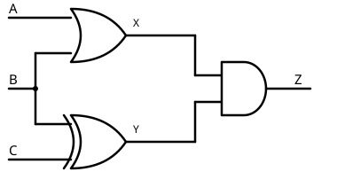
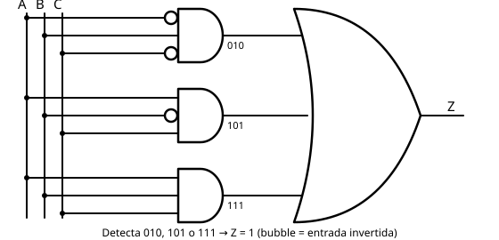

# 06 Análisis y Cálculo de Circuitos

[⬅ Volver al índice](README.md)

Ya vimos las [compuertas base](02%20Compuertas.md), cómo usarlas como
[líneas de control](03%20ConfiguracionesSencillas.md) y cómo
[combinarlas](05%20OtrasConfiguraciones.md) para lograr compuertas de más
o menos entradas. Ahora vamos a ver cómo analizar y calcular circuitos
completos.

## De circuito a tabla de verdad



Dado un circuito, se puede calcular su tabla de verdad analizándolo **por
etapas**: se listan todas las combinaciones de entrada (en orden creciente,
para no repetir ninguna) y se calculan los valores intermedios hasta
llegar al resultado final.

Ejemplo con un circuito de tres entradas A, B, C: una OR entre A y B da un
valor intermedio **X**, una EXOR entre B y C da **Y**, y una AND entre X e
Y da la salida **Z**. Calculando X e Y para las ocho combinaciones y
después la AND entre ambas, se llega a la tabla de verdad completa del
circuito. Con un circuito más grande (30 compuertas, cinco etapas) el
procedimiento es el mismo, solo que toma más tiempo.

## Expresión algebraica del circuito

También se puede escribir la relación en álgebra de Boole, analizando el
circuito desde la salida hacia las entradas: Z = X · Y, X = A + B,
Y = B ⊕ C, entonces:

```
Z = (A + B) · (B ⊕ C)
```

## De tabla de verdad a circuito

El camino inverso también es posible: dada una tabla de verdad, construir
el circuito que la implementa.

Los ingenieros electrónicos usan los **diagramas de Karnaugh** para
resolver esto de forma óptima; acá no los vamos a ver, porque no es
necesario para entender el funcionamiento del computador. Pero sí importa
saber que siempre se puede construir el circuito.

Supongamos una tabla de A, B, C donde Z = 1 solo para las combinaciones
010, 101 y 111, y 0 en el resto. Con una AND de tres entradas (con NOT en
las entradas que deben valer 0, conexión directa en las que deben valer
1) se puede detectar cualquier combinación puntual:

- Para **010**: AND con inversores en A y C, directa en B.
- Para **101**: AND con inversor en B, directas en A y C.
- Para **111**: AND con las tres entradas directas.



Cada una de estas tres AND se pone en uno solo cuando ocurre su
combinación. Como Z debe valer 1 si ocurre 010 **o** 101 **o** 111, las
tres salidas se conectan a una **compuerta OR** de tres entradas, que da
la salida final Z — replicando exactamente la tabla original.

> Con Karnaugh se hubiera llegado a un circuito con menos compuertas; este
> tiene de más, pero funciona igual.

## Equivalencia entre circuitos y optimización algebraica

Dos circuitos distintos pueden tener exactamente la misma tabla de
verdad. El circuito anterior, analizado algebraicamente, da:

```
Z = (Ā · B · C̄) + (A · B̄ · C) + (A · B · C)
```

Aplicando la propiedad distributiva y haciendo reemplazos, se puede pasar
de una expresión a otra equivalente — y muchas veces encontrar una
versión más optimizada. Es decir: además de Karnaugh, el álgebra de Boole
también sirve para optimizar circuitos.

## Cierre

Con lo visto hasta acá, dado cualquier circuito podemos encontrar su
tabla de verdad, y dada cualquier tabla de verdad podemos encontrar un
circuito que la implemente.

---
[⬅ Volver al índice](README.md)
