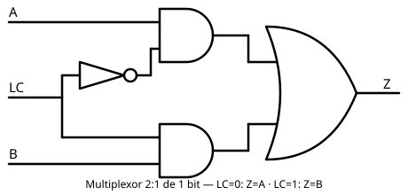

# 07 Multiplexores

[⬅ Volver al índice](README.md)

Con lo visto hasta ahora — las compuertas base, su uso como línea de
control y cómo [analizar y construir circuitos](06%20AnalisisYCalculoDeCircuitos.md)
a partir de una tabla de verdad — podemos armar los **multiplexores**.

## Multiplexor de dos entradas de un bit

Se arma con dos compuertas AND y una OR: un inversor en la línea de
control alimenta a una de las AND (invertida) y a la otra (directa); por
un lado entra el dato A, por el otro el dato B, y ambas AND se conectan a
la OR de salida.

- **LC = 0:** la AND de A queda habilitada (LC invertida = 1) y la de B
  deshabilitada (LC = 0) → **Z = A**.
- **LC = 1:** se invierte: la de B queda habilitada y la de A no →
  **Z = B**.

Es decir, Z copia a A o a B según el valor de la línea de control.

## Multiplexor de cuatro entradas de un bit

Con una sola línea de control solo se puede elegir entre dos opciones.
Para elegir entre cuatro entradas (A, B, C, D) hacen falta **dos** líneas
de control, una por cada combinación:

- **00** → se copia A.
- **01** → se copia B.
- **10** → se copia C.
- **11** → se copia D.

## Multiplexor de dos entradas de 4 bits

Se arma poniendo cuatro multiplexores de dos entradas de un bit en
paralelo, compartiendo una única línea de control. Con cuatro entradas A
(A1–A4), cuatro entradas B (B1–B4) y cuatro salidas Z (Z1–Z4): si LC = 0,
los 4 bits de A pasan a la salida (por ejemplo A = 1010 → Z = 1010); si
LC = 1, pasan los de B. El mismo esquema funciona con buses de 8, 16 o 32
bits.

## Aplicación

Dentro de un computador, un multiplexor permite que un origen u otro
lleguen a un mismo destino según la línea de control — una herramienta
central en el diseño de procesadores, construida enteramente a partir del
multiplexor básico de dos entradas y un bit.

---
[⬅ Volver al índice](README.md)
