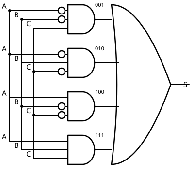
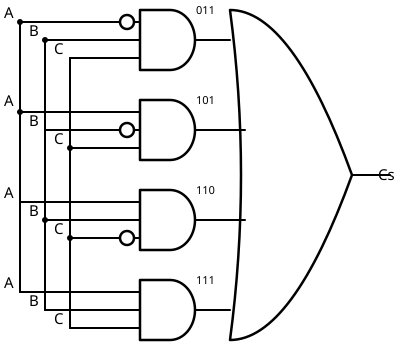
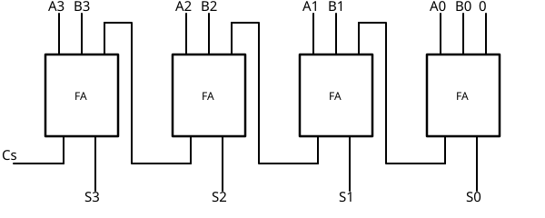
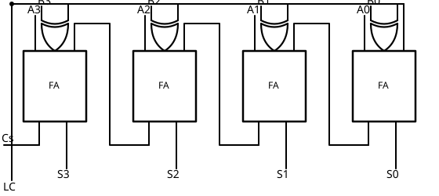

# 08 Construyendo una UAL

[⬅ Volver al índice](README.md)

Con lo que ya sabemos de circuitos ([compuertas](../clase-I/02%20Compuertas.md),
[configuraciones sencillas](../clase-I/03%20ConfiguracionesSencillas.md),
[tabla de verdad → circuito](../clase-I/06%20AnalisisYCalculoDeCircuitos.md))
estamos en condiciones de armar la **UAL** (Unidad Aritmético-Lógica) que
vimos como caja negra en Sistemas de Computación I: un bloque con dos
números de entrada, una línea de control (0 = suma, 1 = resta), un
resultado, y los flags (signo, cero, carry, overflow).

Internamente la UAL solo tiene un **sumador**. Este apunte muestra cómo
construirlo con compuertas.

## El problema: dividirlo en un solo dígito

Armar de una un sumador de 4 (u 8, 16, 32, 64) bits a la vez es
inmanejable: para 4 bits ya son 8 entradas más la línea de control para 4
salidas. La clave es notar que, al sumar dígito a dígito como se hace a
mano, cada posición solo necesita **tres** datos: el bit de A, el bit de
B, y el **carry** que arrastra el dígito anterior. Con eso genera dos
salidas: el bit de la suma y el carry que pasa al dígito siguiente.

Es decir, el problema se reduce a diseñar un circuito de **3 entradas y 2
salidas** — el **sumador de un dígito** (full adder) — y después
replicarlo una vez por cada bit, encadenando el carry de salida de uno
con el carry de entrada del siguiente.

## Tabla de verdad del sumador de un dígito

Entradas A, B y C (carry entrante); salidas S (suma) y Cs (carry
saliente):

| A   | B   | C   | S   | Cs  |
| --- | --- | --- | --- | --- |
| 0   | 0   | 0   | 0   | 0   |
| 0   | 0   | 1   | 1   | 0   |
| 0   | 1   | 0   | 1   | 0   |
| 0   | 1   | 1   | 0   | 1   |
| 1   | 0   | 0   | 1   | 0   |
| 1   | 0   | 1   | 0   | 1   |
| 1   | 1   | 0   | 0   | 1   |
| 1   | 1   | 1   | 1   | 1   |

## Circuito: dos salidas, dos sub-circuitos

Como el circuito tiene dos salidas, se resuelve en dos partes
independientes que comparten las mismas tres entradas: un sub-circuito
que calcula S y otro que calcula Cs.

**Suma (S)**: vale 1 en las combinaciones 001, 010, 100 y 111. Se
detecta cada una con una compuerta AND de 3 entradas (con inversor en
las entradas que deben valer 0), y las cuatro salidas se juntan con una
OR — el mismo método de "tabla de verdad → circuito" ya visto:

**Carry saliente (Cs)**: vale 1 en las combinaciones 011, 101, 110 y 111. Se arma con el mismo método — cuatro AND de 3 entradas (en este
caso ninguna necesita inversor en las tres a la vez, salvo la propia
combinación) más una OR — usando las mismas tres entradas A, B, C:

Este circuito, con S y Cs armados en paralelo, es el sumador de un
dígito completo. Nótese que ni S ni Cs están optimizados (por ejemplo, S
es en realidad A⊕B⊕C): se arman así, con AND y OR directos desde la
tabla de verdad, porque el objetivo es entender que _se puede_ construir,
no encontrar el circuito con menos compuertas — para eso están Karnaugh
y el álgebra de Boole.

## Encadenar dígitos: el sumador de N bits

Una vez armado el sumador de un dígito, se lo encapsula (entradas A, B,
C; salidas S, Cs) y se repite el mismo bloque una vez por bit. El carry
saliente de un bloque entra como carry entrante del siguiente:

- El primer bloque (bit 0, el menos significativo) recibe A0, B0 y una
  entrada de carry libre.
- Cada bloque siguiente recibe Ai, Bi, y el Cs del bloque anterior.
- El carry saliente del último bloque (el más significativo) queda
  disponible para calcular los flags.

Con 4 bloques iguales interconectados así se arma un sumador de 4 bits;
con 8, 16, 32 o 64 bloques, un sumador de esa cantidad de bits. Es
exactamente el sumador interno de la UAL que se analizaba como caja
negra en Sistemas de Computación I.

## De sumador a UAL: sumar y restar

El sumador tal cual queda armado solo suma. Para que la UAL también
reste, hace falta modificar la entrada B antes de que llegue al
sumador, usando la misma idea de **línea de control con XOR** vista en
[configuraciones sencillas](../clase-I/03%20ConfiguracionesSencillas.md):
con LC = 0 la XOR se comporta como un cable (Z = B), con LC = 1 se
comporta como inversor (Z = B̄).

Restar A − B en complemento a dos es sumar A + (complemento de B) + 1,
es decir, invertir B y sumarle uno. Así que:

- Cada bit de B pasa por una compuerta XOR, con la línea de control como
  segunda entrada de las cuatro. Con LC = 0, cada XOR copia el bit de B
  sin cambios (suma normal). Con LC = 1, cada XOR entrega el
  complemento de B (resta).
- El "+1" del complemento a dos se logra con la misma línea de control:
  se conecta a la entrada de carry libre que quedaba en el primer
  sumador (el del bit menos significativo). Con LC = 0 entra un 0 (no
  suma nada extra); con LC = 1 entra un 1 (suma el uno que completa el
  complemento a dos).

Con esto, el mismo sumador interno de un dígito, repetido y con esta
selección en la entrada B, funciona como sumador cuando LC = 0 y como
restador cuando LC = 1 — tal cual el bloque de Sistemas de Computación I.
Falta calcular los flags a partir de este circuito.

---

[⬅ Volver al índice](README.md)
