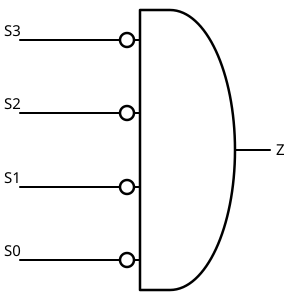
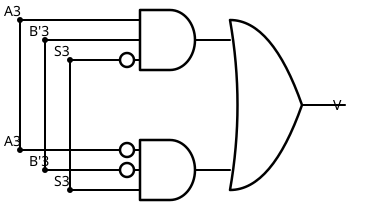

# 09 Cálculo de Flags

[⬅ Volver al índice](README.md)

Con la [UAL ya armada](08%20Construyendo%20una%20UAL.md) — sumador de N
bits, con XOR selectoras en B y la línea de control (LC) alimentando el
carry inicial — falta calcular los cuatro flags: **signo**, **cero**,
**carry** y **overflow**. Para cada uno hay que identificar de qué punto
del circuito sale el dato y qué compuertas hacen falta para llegar al
resultado.

## Signo (S)

Es el flag más simple: es una copia directa del bit más significativo
del resultado (S3 en un ejemplo de 4 bits). No hace falta ninguna
compuerta, es la misma señal cableada hacia afuera.

## Cero (Z)

Se pone en 1 solo cuando **todos** los bits del resultado son 0. Se
detecta con una AND de todos los bits negados: si S3, S2, S1 y S0
valen 0, cada NOT entrega 1 y la AND da 1; si cualquiera de ellos vale
1, esa entrada de la AND llega en 0 y Z se pone en 0.

```
Z = S3' · S2' · S1' · S0'
```



## Carry (C)

Sale del carry de salida del **último** sumador de un dígito (el del
bit más significativo). Si la operación es una suma, el flag copia
directo ese carry. Si es una resta, hay que invertirlo (por cómo
funciona el carry en complemento a dos, la lectura de "hubo acarreo" se
invierte respecto a la suma).

Como la línea de control (LC) ya indica si se está sumando o restando,
alcanza con una compuerta XOR entre el carry de salida y LC: con LC = 0
la XOR copia el carry sin cambios, con LC = 1 lo invierte.

```
C = Cs_final ⊕ LC
```

## Overflow (V)

Es el más complejo. Ocurre cuando se suman dos números del mismo signo y
el resultado da signo distinto — por ejemplo, dos positivos sumando dan
un negativo, o dos negativos dan un positivo. Importante: hay que mirar
los signos que **entran al sumador interno**, no los que entran a la
UAL desde afuera — es decir, el bit A3, el bit B3 *ya pasado por la XOR*
(complementado si es resta), y el bit de signo del resultado S3.

Condición de overflow:

- A3 = 0, B'3 = 0 y S3 = 1 (dos positivos dan un resultado negativo), o
- A3 = 1, B'3 = 1 y S3 = 0 (dos negativos dan un resultado positivo).

```
V = (A3' · B'3' · S3) + (A3 · B'3 · S3')
```

Se arma con dos AND de 3 entradas (cada una con los inversores que le
correspondan) y una OR final que junta ambas condiciones:



## Cierre

Con esto la UAL queda completa: el sumador interno de un dígito
replicado N veces, la selección de suma/resta con XOR sobre B y el
carry inicial, y los cuatro flags calculados a partir de las señales
internas del circuito (signo copiado, cero por AND de negados, carry
por XOR con la línea de control, overflow por comparación de signos de
entrada y salida del sumador).

Es un circuito de **lógica combinacional**: la salida depende
únicamente de la combinación de entradas en un momento dado, sin memoria
de estados anteriores. Escalarlo de 4 a 8, 16, 32 o 64 bits es agregar
más sumadores de un dígito en la cadena — no cambia nada del diseño de
los flags ni de la selección de suma/resta.

No es el circuito óptimo (para eso están los diagramas de Karnaugh y el
álgebra de Boole, que no vemos en esta materia), pero es exactamente el
mismo comportamiento lógico que se estudiaba como caja negra en Sistemas
de Computación I — ahora resuelto con compuertas reales.

---
[⬅ Volver al índice](README.md)
