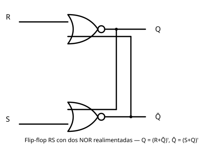

# 10 Circuitos Biestables RS

[⬅ Volver al índice](README.md)

Hasta acá vimos **lógica combinacional**: circuitos cuya salida depende
solo de las entradas actuales, y que se pueden analizar propagando
señales de izquierda a derecha. Ahora entra en juego la **lógica
secuencial**: circuitos donde la salida se reinyecta a la entrada, y por
lo tanto la salida también depende de lo que pasó antes.

## Circuito: dos NOR realimentadas

El circuito base son dos compuertas **NOR** (OR negada) cruzadas: la
salida de cada una entra como una de las entradas de la otra. Quedan
libres una entrada por compuerta —**R** y **S**— y las dos salidas,
**Q** y **Q̄** (complementarias en los estados estables).

Recordar la tabla de la NOR: niega a la OR, así que da 1 únicamente
cuando ambas entradas son 0; con cualquier entrada en 1, la salida es 0.

## Por qué no se puede analizar como un combinacional

Al reinyectar una salida a su propia entrada, no hay un sentido único
de propagación: para calcular la salida hay que conocer la entrada, pero
la entrada depende de la salida. Es el mismo fenómeno del acople de
audio (la salida vuelve a entrar al circuito y este deja de comportarse
como fue diseñado) — reinyectar puede generar inestabilidad.

El método de análisis es otro: se propone una entrada y un estado de
salida, se recalcula el circuito, y se repite hasta que los valores
dejan de cambiar. Si se llega a un punto donde recalcular ya no modifica
nada, ese es un **estado estable**. Si nunca deja de cambiar, el
circuito es inestable en esa condición.

## Tabla de funcionamiento

Aplicando ese método a las cuatro combinaciones de R y S se llega a:

| S   | R   | Q (resultante)  | Estado                    |
| --- | --- | --------------- | -------------------------- |
| 0   | 0   | Q anterior       | Retiene (memoria)          |
| 1   | 0   | 1                | Set                        |
| 0   | 1   | 0                | Reset                      |
| 1   | 1   | 0 en Q **y** Q̄  | Prohibido / indeterminado  |

Con S = R = 0 el circuito reproduce la salida que ya tenía: no depende
de una entrada nueva, sino de la salida anterior. Eso es exactamente
tener **memoria** — el circuito se acuerda de lo que pasó antes porque
la nueva salida depende de la anterior.

## Por qué "biestable" y por qué "RS"

Por tener dos estados estables (Q=0/Q̄=1 y Q=1/Q̄=0), a este circuito se
lo llama **biestable** — el nombre técnico. En la práctica todo el mundo
lo conoce como **flip-flop**, y a este en particular como **flip-flop
RS**: la entrada S (*set*) pone Q en 1, la entrada R (*reset*) pone Q en
0.

## El estado prohibido S = R = 1

Con S = R = 1 ambas salidas quedan en 0, rompiendo la relación de
complemento que Q y Q̄ mantienen en todo estado estable. No es un
estado inestable en sí (mientras se sostiene S=R=1 el circuito no
oscila), pero es **indeterminado** al salir de él: como nunca ambas
salidas pueden pasar a 0 exactamente al mismo tiempo, una compuerta
reacciona una fracción de segundo antes que la otra, y esa es la que
termina determinando si el circuito cae en Q=0/Q̄=1 o en Q=1/Q̄=0. Por
esto no se usa esa combinación de entrada.

El mismo flip-flop se puede construir con compuertas NAND en vez de
NOR: el funcionamiento es análogo, pero la combinación de entrada
prohibida es la opuesta (0,0 en vez de 1,1).

## Ejemplo físico: lamparita con dos botones

Un armado equivalente con una sola salida Q (una lamparita), un 1
permanente como entrada de datos, y dos botones: uno pone un 1 en S,
el otro pone un 1 en R. Tocar el botón de S prende la lamparita; tocarlo
de nuevo no cambia nada (ya está prendida). Tocar el botón de R la
apaga; tocarlo de nuevo tampoco cambia nada. De ahí el nombre *set*
(establecer) y *reset* (volver al estado anterior/apagar).

Este flip-flop también se llama **asincrónico**: presionar un botón no
está atado a ninguna señal de sincronismo, se puede accionar en
cualquier momento.

## Qué sigue

El RS es el primer elemento de memoria del curso. A partir de él se van
a ver dos flip-flops más, con fines didácticos:

- El **D-latch**, que en realidad se construye con un RS adentro,
  ajustando cómo llegan las entradas.
- El **maestro-esclavo**, armado con dos D-latch en una configuración
  particular.

Interesan porque con el D-latch se arma una **memoria estática**, y con
el maestro-esclavo se arman los **registros** del procesador.
Entendiendo memoria, registros, la UAL y el multiplexor (ya vistos) y
las compuertas tri-state, queda el terreno preparado para armar en la
próxima clase un computador con más instrucciones que el modelo visto
en Sistemas de Computación I.

---

[⬅ Volver al índice](README.md)
