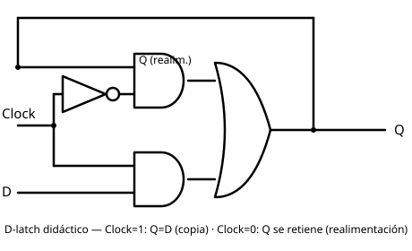
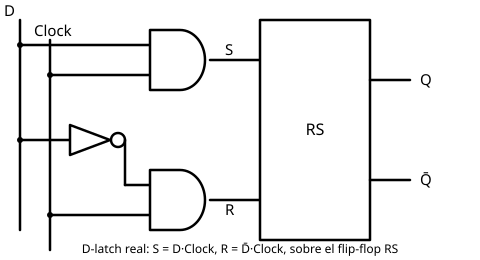

# 11 Circuitos Biestables D-Latch

[⬅ Volver al índice](README.md)

El primer flip-flop que se arma sobre el [RS](10%20Circuitos%20Biestables%20RS.md)
es el **D-latch** ("latch" = candado, cerrojo). Tiene una entrada de
datos **D**, una entrada de **Clock**, y la salida **Q** realimentada a
la entrada. Al depender de una señal de clock, es un flip-flop
**sincrónico**.

## Circuito didáctico: selector con línea de control

Se arma con la misma técnica de "compuerta con línea de control" ya
vista (línea de control con XOR en
[configuraciones sencillas](../clase-I/03%20ConfiguracionesSencillas.md)
y en la [UAL](../clase-II/08%20Construyendo%20una%20UAL.md)): el clock
actúa como selector entre D y la realimentación de Q, de forma
equivalente a un multiplexor de 2 entradas:

```
Q = Clock ? D : Q
```



Analizando los dos casos:

- **Clock = 1**: el selector deja pasar D. La salida sigue a D en todo
  momento — si D cambia mientras Clock está en 1, Q cambia con él. A
  este estado se lo llama **modo copia**.
- **Clock = 0**: el selector deja pasar la realimentación de Q. Lo que
  ya estaba en la salida se vuelve a poner en la salida, así que se
  mantiene indefinidamente. A este estado se lo llama **modo retención**
  — lo que se retiene es el último valor de D que fue válido mientras
  Clock estuvo en 1.

### Ejemplo con una secuencia de clock

Si D varía libremente y el clock pasa por pulsos 1-0-1-0:

| Fase | Clock | D          | Q                                  |
| ---- | ----- | ---------- | ----------------------------------- |
| 1    | 1     | 0 → 1 → 0  | copia exactamente a D: 0 → 1 → 0    |
| 2    | 0     | (cualquiera) | retiene el último valor copiado (0) |
| 3    | 1     | 0 → 1      | vuelve a copiar: 0 → 1              |
| 4    | 0     | (cualquiera) | retiene el último valor copiado (1) |

## El problema del circuito didáctico

Los circuitos reales no cambian de estado en forma instantánea: un
flanco que a escala de segundos se ve vertical, a escala de
nanosegundos es en realidad una rampa. Como el clock que entra al
selector pasa además por un inversor (con su propio retardo), en la
transición de Clock de 1 a 0 puede darse una carrera entre ambas señales
de control: si el valor invertido no llega a tiempo, el circuito puede
realimentarse a 0 antes de terminar de retener el valor que tenía que
quedar guardado. Ese transitorio es una fuente real de inestabilidad en
la transición.

## Circuito real: D-latch construido con un RS

Por eso el D-latch que se encuentra en la práctica no es el selector de
arriba, sino un [flip-flop RS](10%20Circuitos%20Biestables%20RS.md) con
compuertas AND que adaptan D y Clock a las entradas S y R:

```
S = D  · Clock
R = D̄ · Clock
```



| Clock | D   | S   | R   | Q                    |
| ----- | --- | --- | --- | -------------------- |
| 0     | x   | 0   | 0   | retiene (estado RS)  |
| 1     | 0   | 0   | 1   | 0 — reset, copia D=0 |
| 1     | 1   | 1   | 0   | 1 — set, copia D=1   |

Con Clock=0 se fuerza S=R=0, el estado de retención del RS. Con
Clock=1, S y R quedan determinados por D y su complemento, así que
nunca pueden valer 1 al mismo tiempo: la combinación prohibida del RS
(S=R=1) queda excluida por construcción. Por eso esta versión no
presenta el problema de carrera del circuito didáctico con selector —
el cambio de estado lo dispara el propio RS al setearse o resetearse,
sin depender de que dos señales lleguen sincronizadas a tiempo.

---

[⬅ Volver al índice](README.md)
