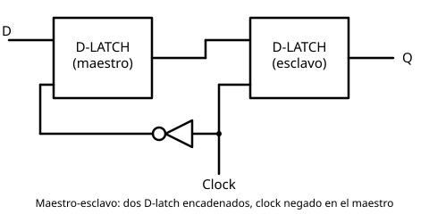

# 12 Circuitos Biestables Maestro-Esclavo

[⬅ Volver al índice](README.md)

El **flip-flop maestro-esclavo** se arma con dos
[D-latch](11%20Circuitos%20Biestables%20D-Latch.md), ni más ni menos, en
una configuración particular:

- La salida del **maestro** se conecta a la entrada D del **esclavo**
  (de ahí el nombre: los datos que llegan al esclavo son siempre los
  que le dicta el maestro).
- La entrada D del conjunto es la entrada D del maestro.
- La salida Q del conjunto es la salida Q del esclavo.
- El clock del conjunto entra **negado** al maestro y **sin negar** al
  esclavo.

Desde afuera, el maestro-esclavo tiene las mismas patas que un D-latch
(D, Clock, Q), pero el comportamiento interno es distinto.

## Análisis por estado del clock

Como el maestro recibe el clock negado, cuando el clock externo vale 0
el maestro ve un 1 (modo copia) y el esclavo ve un 0 (modo retención); y
al revés cuando el clock externo vale 1.

- **Clock = 0**: el maestro está en modo copia — su salida sigue a D en
  todo momento, con las mismas variaciones que tenga D. El esclavo está
  reteniendo lo que el maestro le pasó la última vez que estuvo en modo
  copia (medio ciclo antes).
- **Clock = 1**: el maestro pasa a retener — congela el último valor de
  D justo en el instante de la transición. El esclavo pasa a copiar, y
  como la entrada del esclavo es la salida del maestro, copia ese valor
  recién congelado.

| Clock | Maestro                                  | Esclavo                          | Q (salida)                                   |
| ----- | ----------------------------------------- | --------------------------------- | ---------------------------------------------- |
| 0     | copia D (sigue sus variaciones)           | retiene                           | valor capturado en el último flanco 0→1        |
| 1     | retiene (congela D en el instante del flanco) | copia al maestro                | igual al valor recién congelado por el maestro |

## Diferencia clave con el D-latch simple

En el D-latch simple, mientras el clock está en 1 hay una conexión
directa entre D y Q: si D varía, Q varía con él en tiempo real. En el
maestro-esclavo esa conexión directa no existe en ningún instante — el
esclavo nunca ve a D directamente, solo ve lo que el maestro ya congeló.
Como consecuencia:

- La salida Q solo cambia una vez por ciclo de clock, en el instante en
  que el clock pasa de 0 a 1: toma el valor que D tenía justo antes de
  esa transición.
- Una vez fijado ese valor, Q permanece estable durante todo el resto
  del ciclo (tanto mientras el clock sigue en 1 como durante el
  siguiente período en 0), sin importar cómo varíe D mientras tanto —
  algo que no ocurría en el D-latch, estable solo durante el clock en 0.
- Hay un corrimiento de medio ciclo entre la entrada y la salida, por
  el escalonamiento maestro → esclavo.

## Por qué se usa el maestro-esclavo

Porque al no existir esa conexión directa entrada-salida, se evita el
problema que sí puede darse con una copia directa: si este flip-flop
formara parte de un circuito más grande donde su salida termina
realimentando (aunque sea indirectamente) su propia entrada, la copia
directa del D-latch puede hacer que el circuito quede cambiando de
valor todo el tiempo. El maestro-esclavo, al fijar la salida una sola
vez por ciclo, no tiene ese problema.

---

[⬅ Volver al índice](README.md)
